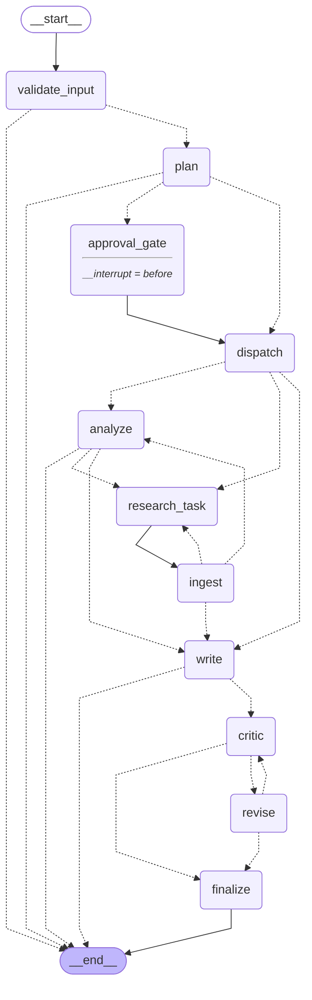

# Research workflow graph

_Generated from the compiled LangGraph by `scripts/export_graph.py`; do not edit by hand._

```mermaid
---
config:
  flowchart:
    curve: linear
---
graph TD;
	__start__([<p>__start__</p>]):::first
	validate_input(validate_input)
	approval_gate(approval_gate<hr/><small><em>__interrupt = before</em></small>)
	dispatch(dispatch)
	research_task(research_task)
	ingest(ingest)
	finalize(finalize)
	plan(plan)
	analyze(analyze)
	write(write)
	critic(critic)
	revise(revise)
	__end__([<p>__end__</p>]):::last
	__start__ --> validate_input;
	analyze -.-> __end__;
	analyze -.-> research_task;
	analyze -.-> write;
	approval_gate --> dispatch;
	critic -.-> finalize;
	critic -.-> revise;
	dispatch -.-> analyze;
	dispatch -.-> research_task;
	dispatch -.-> write;
	ingest -.-> analyze;
	ingest -.-> research_task;
	ingest -.-> write;
	plan -.-> __end__;
	plan -.-> approval_gate;
	plan -.-> dispatch;
	research_task --> ingest;
	revise -.-> critic;
	revise -.-> finalize;
	validate_input -.-> __end__;
	validate_input -.-> plan;
	write -.-> __end__;
	write -.-> critic;
	finalize --> __end__;
	classDef default fill:#f2f0ff,line-height:1.2
	classDef first fill-opacity:0
	classDef last fill:#bfb6fc
```
